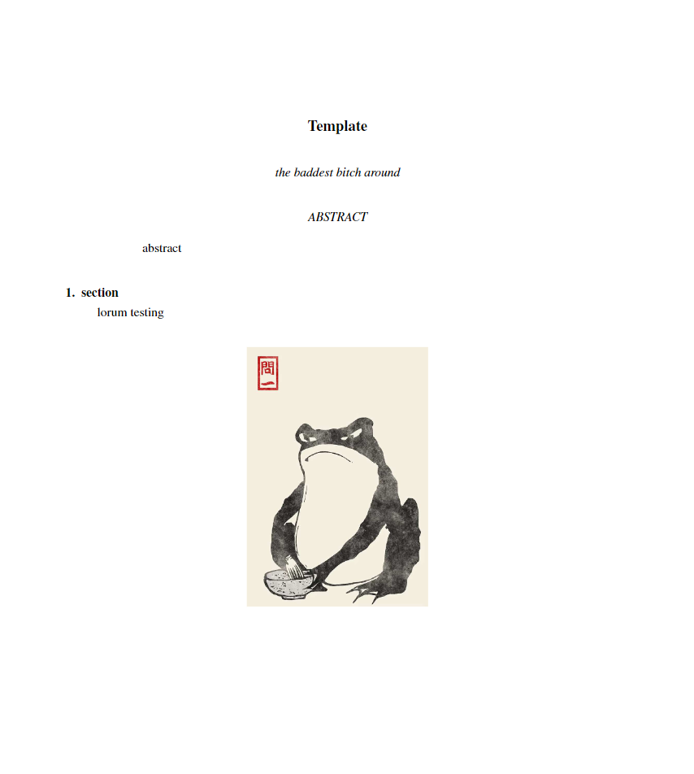

# groff-template
a template file for writing report in groff

cheat sheet https://l04db4l4nc3r.github.io/groff-cheatsheet/

to start the auto complier, run `make auto_comp`

to just complie the current groff file run `make`

current make should create this

## cache
this dir stores converted images form the auto_complier script, as groff only really likes to deal with postscript images
note this dir can not handle other dirs within it

## images
this store all the image that is used within the report

## RES
this is mainly for storing all the code that is needed for the creation of the image/graphs within the report